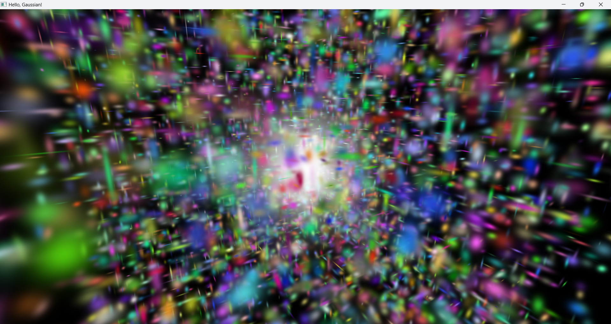
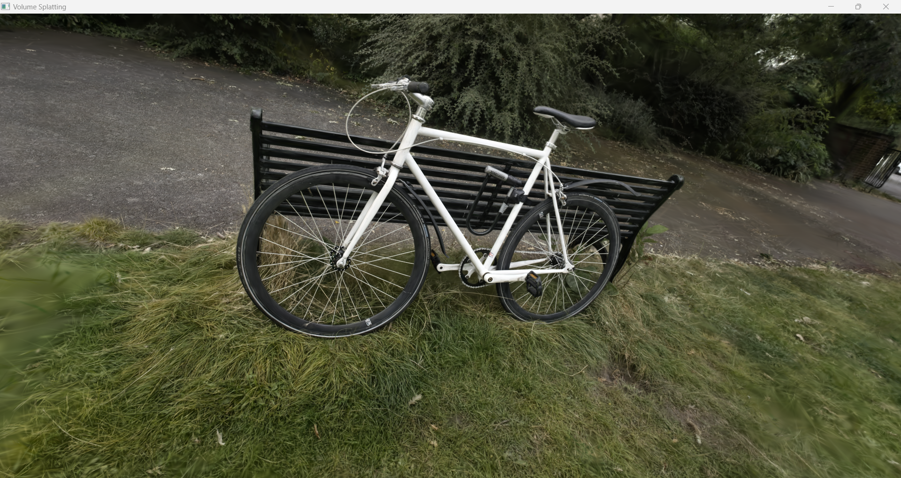

# Usage samples
To build these samples, specify `-DTORPEDO_BUILD_DEMO=ON` during CMake configuration. Note that some of these samples
require Internet connection so that CMake can fetch assets (textures, point cloud, etc.) relevant to the application.

## Hello, Gaussian!

[Slang](https://github.com/shader-slang/slang)-based implementation of the Gaussian-based rasterizer as described in
[3D Gaussian Splatting for Real-Time Radiance Field Rendering](https://repo-sam.inria.fr/fungraph/3d-gaussian-splatting/).

Demonstrate basic usage of `Context`, `SurfaceRenderer`, `Camera`, `Scene`, and `OrbitControl`, see [main.cpp](HelloGaussian/main.cpp).

## Volume Splatting

Render a trained Gaussian splatting model.

Demonstrate basic transform capabilities via `TransformHost`, see [main.cpp](VolumeSplatting/main.cpp).